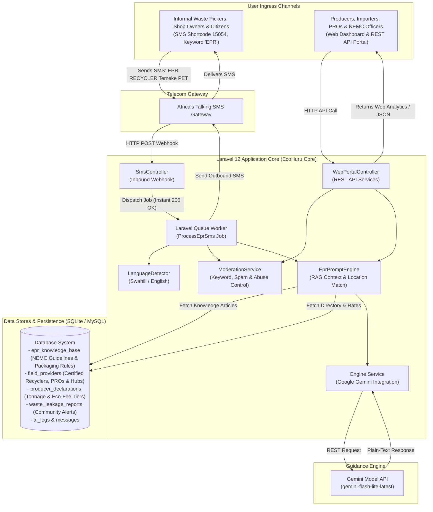

# EcoHuru EPR Platform: Master Technical & Operational Architecture

## 1. Executive Summary & Core Value Proposition

The **EcoHuru Extended Producer Responsibility (EPR) Platform** adapts the **Huru dual-channel (SMS + Web) RAG guidance engine** to solve Tanzania's plastic packaging management challenge. As detailed in environmental policy research, Tanzania generates 1.7–2.5 million tonnes of solid waste annually (approx. 12% plastic), yet **less than 4% is currently recycled** and over 29,000 tonnes leak into waterways and coastal marine environments each year.

While Tanzania has established policy frameworks—such as the *Environmental Management (Prohibition of Plastic Carrier Bags and Plastic Bottle Cap Seals) Regulations, 2022* and the *2025–2030 National Waste Management Strategy*—the central bottleneck is **moving from regulatory policy to measurable system performance and data-driven execution**.

### Key System Objectives:
1. **Bridge the Digital Divide for Informal Waste Pickers**: Enable informal collectors on basic feature phones (without internet) to receive real-time plastic buyback prices and locate nearby certified recycling hubs via SMS.
2. **Automate Producer Compliance & Eco-Fee Guidance**: Provide manufacturers and importers with automated calculations for eco-modulated fees and actionable eco-design recommendations (e.g., switching to mono-materials or non-colored caps).
3. **Empower Small Business Regulatory Compliance**: Offer instant text-based legal clarification on banned plastics, cap seals, and compliant packaging alternatives for local shop owners.
4. **Enable Community Plastic Leakage Reporting**: Allow citizens to log plastic waste accumulation or clogged drainage channels via SMS, routing alerts to local municipal officers and registered collector co-ops.
5. **Supply Regulators (NEMC & PROs) with Verifiable Telemetry**: Provide a centralized web dashboard to monitor inquiries, collection demands, regional recycling volumes, and producer compliance status.

---

## 2. Multi-Stakeholder Impact & Feature Matrix

| Stakeholder Group | Primary Channel | Core Problem Solved | Platform Feature / Capability |
| :--- | :--- | :--- | :--- |
| **Informal Waste Pickers & Collectors** | **SMS (Feature Phone)** | Lack of internet access and real-time market prices for plastics. | `EPR RECYCLER [District] [Material]` syntax returning live buyback prices (TZS/kg) & contact info for certified local hubs. |
| **Producers, Manufacturers & Importers** | **Web Portal & SMS** | Confusion over packaging classification, EPR obligations, and fee tariffs. | `EPR FEE [Material] [Specs] [Quantity]` calculator providing instant eco-fee totals & cost-saving eco-design advice. |
| **Small Businesses & Retailers** | **SMS (Feature Phone)** | Unawareness of regulations (e.g., 2022 Cap Seal bans) leading to compliance fines. | `EPR REGULATION [Topic]` supplying plain-text legal guidance and approved packaging alternatives. |
| **Communities & Citizens** | **SMS (Feature Phone)** | Plastic waste blocking drainage channels causing localized flooding. | `EPR RIPOTI [District] [Location]` logging waste accumulation for municipal & recycler dispatch. |
| **Regulators (NEMC, VPO) & PROs** | **Web Dashboard** | Lack of verified performance data, waste tracking, and compliance metrics. | Web REST API & Dashboard for monitoring inquiry hot-spots, recycling volumes, and producer declarations. |

---

## 3. End-to-End System Architecture



---

## 4. Standardized SMS Command Protocol & Real-World Workflows

To ensure seamless execution on basic feature phones, EcoHuru implements a structured SMS command protocol under Africa's Talking shortcode `15054` (Keyword: `EPR`):

```carousel
### Command 1: Recycler & Buyback Price Lookup
- **SMS Input**: `EPR RECYCLER Temeke PET`
- **System Action**: Extracts district `Temeke` and material `PET`. Queries `field_providers` table.
- **Outbound SMS (Swahili/Plain-Text)**:
  "Vituo vya PET Temeke: 1. Kijichi Sorting Hub (0712-345-678) TZS 400/kg. 2. Chang'ombe Recyclers (0754-123-456) TZS 420/kg. Tenganisha chupa safi na zisizo na vifuniko kwa bei ya juu."
<!-- slide -->
### Command 2: Producer Eco-Fee & Design Calculator
- **SMS Input**: `EPR FEE PET bottle clear 500ml 10000 units`
- **System Action**: Invokes `EprPromptEngine` RAG with NEMC eco-modulation fee rules.
- **Outbound SMS (Plain-Text)**:
  "Chupa za PET safi zipo Tiers 1 (Recyclable). Ada ya Producer: TZS 150,000. Badili vifuniko kuwa visivyo na rangi kuokoa TZS 20,000. Mawasiliano ya PRO: 07xx-xxx-xxx."
<!-- slide -->
### Command 3: Small Business Regulatory Check
- **SMS Input**: `EPR REGULATION bottle cap seals`
- **System Action**: Queries `epr_knowledge_base` for the 2022 Plastic Bottle Cap Seals Regulations.
- **Outbound SMS (Plain-Text)**:
  "Kulingana na Kanuni za 2022, mifuniko ya plastiki yenye nembo ya ziada (cap seals) imepigwa marufuku. Tumia neck rings au mifuniko iliyoidhinishwa na TBS/NEMC kuepuka faini."
<!-- slide -->
### Command 4: Community Leakage Reporting
- **SMS Input**: `EPR RIPOTI Ilala Daraja la Msimbazi limejaa chupa za plastiki`
- **System Action**: Logs record in `waste_leakage_reports`. Dispatches notification to Municipal Waste Officer.
- **Outbound SMS (Plain-Text)**:
  "Taarifa yako ya taka za plastiki Msimbazi Ilala imepokelewa (Kumb: #W-892). Afisa Mazingira na Kikundi cha Watoza Taka wametaarifiwa. Ahsante kwa kulinda mazingira!"
```

---

## 5. Database Schema Adaptation Blueprint

Adapted directly from the core Huru database schema:

### A. `epr_knowledge_base` (Replaces `curriculums`)
```sql
CREATE TABLE epr_knowledge_base (
    id INTEGER PRIMARY KEY AUTOINCREMENT,
    title VARCHAR(255) NOT NULL,
    category VARCHAR(100) NOT NULL, -- e.g., 'REGULATION', 'ECO_DESIGN', 'FEE_TIERS', 'RECYCLING_GUIDE'
    content TEXT NOT NULL,
    keywords TEXT NOT NULL, -- comma-separated search tokens
    language VARCHAR(10) DEFAULT 'sw',
    is_active BOOLEAN DEFAULT 1,
    created_at TIMESTAMP,
    updated_at TIMESTAMP
);
```

### B. `field_providers` (Replaces `legal_aid_providers`)
```sql
CREATE TABLE field_providers (
    id INTEGER PRIMARY KEY AUTOINCREMENT,
    name VARCHAR(255) NOT NULL,
    provider_type VARCHAR(100) NOT NULL, -- 'RECYCLER', 'AGGREGATOR_HUB', 'PRO', 'INSPECTION_OFFICE'
    region VARCHAR(100) NOT NULL,
    district VARCHAR(100) NOT NULL,
    ward VARCHAR(100) NULL,
    phone VARCHAR(50) NOT NULL,
    accepted_materials TEXT NOT NULL, -- e.g., 'PET, HDPE, MULTILAYER'
    buyback_rates_json TEXT NULL, -- e.g., {"PET": 400, "HDPE": 350}
    is_verified BOOLEAN DEFAULT 1,
    created_at TIMESTAMP,
    updated_at TIMESTAMP
);
```

### C. `producer_declarations` (New Compliance Module)
```sql
CREATE TABLE producer_declarations (
    id INTEGER PRIMARY KEY AUTOINCREMENT,
    company_name VARCHAR(255) NOT NULL,
    tin_number VARCHAR(50) NOT NULL,
    packaging_type VARCHAR(100) NOT NULL,
    material_category VARCHAR(100) NOT NULL,
    quarterly_tonnage DECIMAL(10,2) NOT NULL,
    calculated_eco_fee DECIMAL(12,2) NOT NULL,
    pro_membership_id VARCHAR(100) NULL,
    status VARCHAR(50) DEFAULT 'PENDING',
    created_at TIMESTAMP
);
```

### D. `waste_leakage_reports` (New Community Reporting Module)
```sql
CREATE TABLE waste_leakage_reports (
    id INTEGER PRIMARY KEY AUTOINCREMENT,
    report_code VARCHAR(20) UNIQUE NOT NULL,
    sender_phone VARCHAR(50) NOT NULL,
    district VARCHAR(100) NOT NULL,
    location_details TEXT NOT NULL,
    description TEXT NOT NULL,
    status VARCHAR(50) DEFAULT 'PENDING', -- PENDING, ASSIGNED, RESOLVED
    assigned_to VARCHAR(255) NULL,
    created_at TIMESTAMP
);
```

---

## 6. Technical Implementation Details

### A. Dynamic RAG Search (`EprPromptEngine.php`)
```php
namespace App\Services;

use App\Models\EprKnowledgeBase;
use App\Models\FieldProvider;

class EprPromptEngine
{
    public function buildPrompt(string $userQuery, string $language = 'sw'): string
    {
        $keywords = $this->extractKeywords($userQuery);
        $knowledgeContext = $this->fetchKnowledgeContext($keywords, $language);
        $providersContext = $this->fetchProvidersContext($userQuery);

        $systemPrompt = "You are EcoHuru, an official Extended Producer Responsibility (EPR) guidance assistant in Tanzania. "
            . "Provide direct, factual guidance based ONLY on the provided context. "
            . "CONSTRAINTS: "
            . "1. Produce STRICT PLAIN TEXT with ZERO asterisks (*) or markdown formatting. "
            . "2. Keep response under 160 words. "
            . "3. Output MUST be in " . ($language === 'sw' ? 'Swahili' : 'English') . ".\n\n"
            . "OFFICIAL KNOWLEDGE CONTEXT:\n" . $knowledgeContext . "\n\n"
            . "RECYCLERS & PRO DIRECTORY:\n" . $providersContext . "\n\n"
            . "USER QUERY: " . $userQuery;

        return $systemPrompt;
    }

    private function fetchProvidersContext(string $query): string
    {
        // Extract district and material from query
        // Query field_providers table for matching verified aggregators
        return FieldProvider::where('is_verified', true)
            ->get()
            ->map(fn($p) => "{$p->name} ({$p->district}): {$p->phone}, Rates: {$p->buyback_rates_json}")
            ->implode("\n");
    }
}
```

---

## 7. Step-by-Step Deployment Blueprint

1. **Step 1: Database Setup & Migrations**:
   - Run Laravel migrations for `epr_knowledge_base`, `field_providers`, `producer_declarations`, and `waste_leakage_reports`.
   - Seed initial policy datasets from [publication.pdf](file:///e:/MICHAEL%20KILUNGA/COMPANY/HURU%20DIGITAL%20%20CO%20LTD/AI%20PROJECT/new_solution/publication.pdf) (NEMC guidelines, 2022 bottle cap regulations, eco-fee tiers).

2. **Step 2: Telecom Gateway Connection**:
   - Register shortcode `15054` and keyword `EPR` on Africa's Talking portal.
   - Point inbound HTTP webhook URL to `https://your-domain.co.tz/api/sms/inbound`.

3. **Step 3: Background Queue Configuration**:
   - Configure Supervisor daemon to keep Laravel queue workers active:
     `php artisan queue:work --queue=default --tries=3`

4. **Step 4: Web Dashboard Deployment**:
   - Build lightweight admin dashboard for NEMC and PRO administrators to review:
     - Real-time waste report heatmaps.
     - Producer fee declaration logs.
     - Top queried districts and plastic types.

5. **Step 5: Pilot Rollout**:
   - Launch pilot program in Dar es Salaam (Kinondoni, Ilala, Temeke) targeting informal waste collector groups, scrap buyers, and local beverage distributors.
