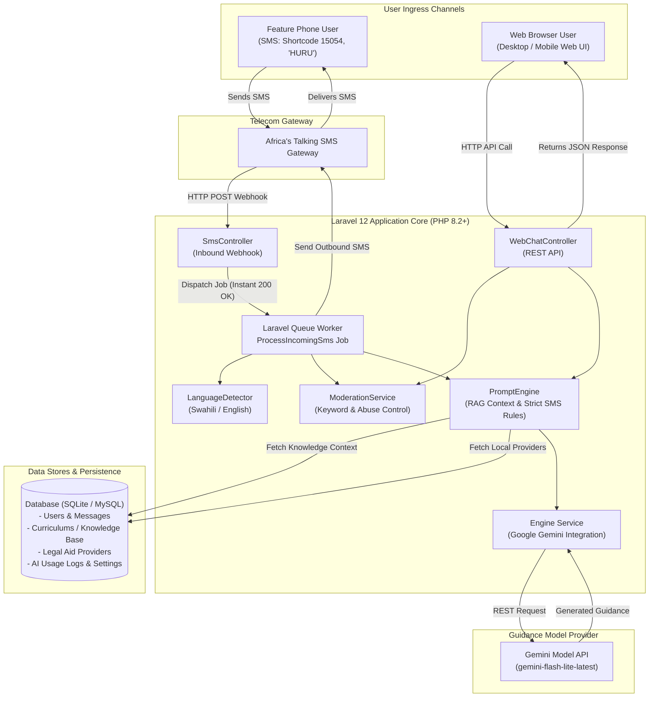

# Technical Architecture & Replication Blueprint: HuruLearn Platform

## 1. Executive Summary & Core Value Proposition

The **HuruLearn** platform is built as an **offline-first, dual-channel guidance engine** capable of delivering instant, contextual knowledge over **SMS** (for basic feature-phone users without internet) and **Web** (for smartphone and desktop users).

By combining **telecom gateway integrations (Africa's Talking)**, an **asynchronous job queue pipeline**, a **Lightweight Retrieval-Augmented Generation (RAG) system**, and **strict SMS plain-text formatting**, this architecture enables users in low-bandwidth or zero-internet rural settings to receive accurate, localized answers.

---

## 2. Technical Stack & Component Architecture



---

## 3. Deep Dive into Core Technical Subsystems

### A. Telecom & Gateway Integration (`SMS Channel`)
* **Shortcode & Keyword Protocol**: Uses **Africa's Talking** shortcode `15054` with shared keyword `HURU`.
* **Instant Async Webhook Handshake**: `[SmsController.php](file:///e:/MICHAEL%20KILUNGA/COMPANY/HURU%20DIGITAL%20%20CO%20LTD/AI%20PROJECT/offlinechatbot/app/Http/Controllers/SmsController.php#L11-L47)` receives the HTTP POST payload, strips the prefix keyword (`HURU`), dispatches a `[ProcessIncomingSms](file:///e:/MICHAEL%20KILUNGA/COMPANY/HURU%20DIGITAL%20%20CO%20LTD/AI%20PROJECT/offlinechatbot/app/Jobs/ProcessIncomingSms.php)` background job, and immediately returns HTTP `200 OK` to avoid telecom gateway timeout.
* **Outbound SMS Dispatch**: Handled via `[SmsService.php](file:///e:/MICHAEL%20KILUNGA/COMPANY/HURU%20DIGITAL%20%20CO%20LTD/AI%20PROJECT/offlinechatbot/app/Services/SmsService.php#L18-L47)` wrapping Africa's Talking PHP SDK.

### B. Dynamic Context Retrieval & RAG (`PromptEngine.php`)
Rather than relying solely on raw model generation, `[PromptEngine.php](file:///e:/MICHAEL%20KILUNGA/COMPANY/HURU%20DIGITAL%20%20CO%20LTD/AI%20PROJECT/offlinechatbot/app/Services/PromptEngine.php)` enriches every query using a lightweight proximity search:
1. **Keyword Extraction**: Strips punctuation and common stop words from the query.
2. **Curriculum/Knowledge Match**: Queries `curriculums` table matching keywords against curriculum entries (`autoFetchContext`).
3. **Geographic Entity Lookup**: Extracts location names (wards, districts, regions) and queries `legal_aid_providers` (`findLocalProviders`).
4. **Factsheet Injection**: Appends authoritative official contact details and reference facts.

### C. SMS Plain-Text & Constraints Engine
SMS text on feature phones cannot render markdown formatting (such as `**bold**`, `*italics*`, or bullet points). `PromptEngine` enforces strict constraints:
* **Zero Asterisks Rule**: Formatted to produce strictly plain text with zero `*` characters.
* **Word/Token Limits**: Restricts output length (`ai_max_words` setting, default ~320 words) to ensure responses fit standard SMS segment constraints.
* **Language Consistency**: Detects input language (`LanguageDetector.php`) and enforces response generation in the exact same language (Swahili/English).

### D. Moderation, Abuse Tracking & Banning (`ModerationService.php`)
* **Proactive Safeguards**: Pre-filters incoming messages against forbidden keyword lists in Swahili and English (`[ModerationService.php](file:///e:/MICHAEL%20KILUNGA/COMPANY/HURU%20DIGITAL%20%20CO%20LTD/AI%20PROJECT/offlinechatbot/app/Services/ModerationService.php#L12-L38)`).
* **Progressive Warning System**: Tracks `abuse_count` per user phone number:
  * Count 1–2: Issues automated warning SMS.
  * Count 3+: Sets `is_banned = true` and halts processing.
* **Safety Block Fallback**: Catches model safety trigger exceptions (`BANNED_CONTENT_DETECTED`) and increments abuse tracking.

### E. Telemetry & Analytics (`AiLog.php`)
Every response records detailed token telemetry in `ai_logs`:
* Prompt token count
* Completion token count
* Total token count
* Model version identifier
* Response timestamp and link to message entry

---

## 4. Replication Blueprint: Adapting the Technology to New Domains

This technology architecture can be directly copied and re-purposed for any domain requiring offline/SMS & web guidance. Below are 4 high-impact application scenarios:

```carousel
### Scenario 1: Agricultural Extension Guidance (Kilimo Smart)
- **Target Audience**: Rural farmers without regular internet.
- **Data Source (`curriculums` table replacement)**: Crop disease info, weather-based planting schedules, market pricing, fertilizer rates.
- **Provider Lookup (`legal_aid_providers` replacement)**: Nearby agricultural extension officers, seed distributors, veterinary centers.
- **Keyword Keyword**: `KILIMO` via SMS shortcode `15054`.
<!-- slide -->
### Scenario 2: Community Health & Maternal Care Guidance (Afya Mobile)
- **Target Audience**: Expectant mothers and community health workers in remote clinics.
- **Data Source**: Antenatal care milestones, vaccination schedules, nutrition guides, emergency triage guidance.
- **Provider Lookup**: Nearby public health dispensaries, ambulance services, regional hospitals.
- **Keyword**: `AFYA` via SMS shortcode `15054`.
<!-- slide -->
### Scenario 3: Micro-Entrepreneurship & Financial Literacy (Biashara)
- **Target Audience**: Informal sector traders, youth entrepreneurs, microfinance borrowers.
- **Data Source**: Tax compliance basics (TRA guides), business licensing steps, bookkeeping guidance, grant opportunities.
- **Provider Lookup**: Local SIDO offices, financial advisory centers, district trade desks.
- **Keyword**: `BIASHARA` via SMS shortcode `15054`.
<!-- slide -->
### Scenario 4: Civic Education & Disaster Response (Msaada / Thamani)
- **Target Audience**: Citizens seeking emergency response steps, disaster alerts, civic voting procedures.
- **Data Source**: Disaster management steps (floods, drought), voter registration guides, local government contact rules.
- **Provider Lookup**: Regional disaster management committees, ward executive officers (WEO), emergency services.
- **Keyword**: `MSAADA` via SMS shortcode `15054`.
```

---

## 5. Step-by-Step Implementation Roadmap for Replicating the System

To clone this technology for a new problem domain, follow these 6 modular steps:

1. **Database Schema Adaptation**:
   - Retain `users`, `messages`, `ai_logs`, `system_settings`, `prompt_templates`.
   - Rename/Adapt `curriculums` $\rightarrow$ `knowledge_articles` (fields: `title`, `content`, `keywords`, `category`, `language`, `is_active`).
   - Rename/Adapt `legal_aid_providers` $\rightarrow$ `field_providers` (fields: `name`, `region`, `district`, `location`, `phone`, `email`, `services`).

2. **Domain Service Adaptation**:
   - Duplicate `PromptEngine.php` into `DomainPromptEngine.php`.
   - Update domain constraints (e.g., Agricultural instructions or Health warnings).
   - Update `findLocalProviders()` to search `field_providers`.

3. **SMS Shortcode Keyword Switch**:
   - In `SmsController.php`, change `$keyword = 'HURU';` to your new domain keyword (e.g., `$keyword = 'KILIMO';`).

4. **Model Configuration**:
   - Update `.env` with your preferred model provider key (e.g., Gemini API key).
   - Configure max token limit and max word count via `system_settings`.

5. **Interface Styling**:
   - Utilize clean, grounded governmental palettes: Deep Royal Blue (`#1e40af`), Forest Green (`#166534`), and crisp white/off-white (`#ffffff`, `#f8fafc`).
   - Ensure light backgrounds and zero AI branding in user-facing texts.

6. **Queue & Deployment Setup**:
   - Run background worker: `php artisan queue:work` (or supervisor daemon).
   - Expose inbound route `/api/sms/inbound` to Africa's Talking callback URL.
